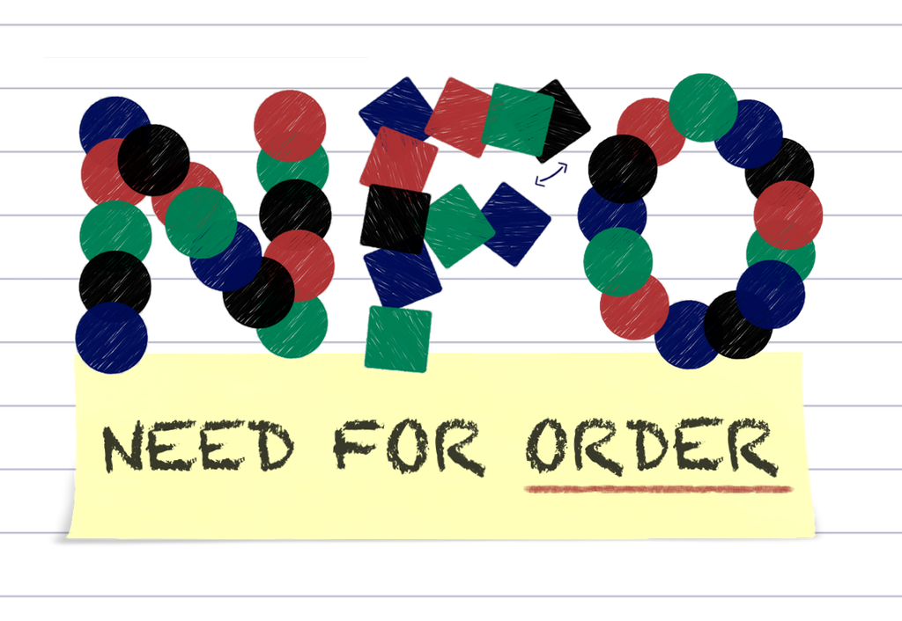
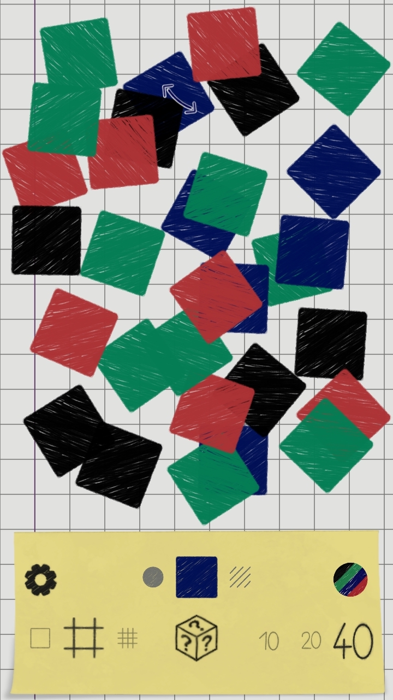
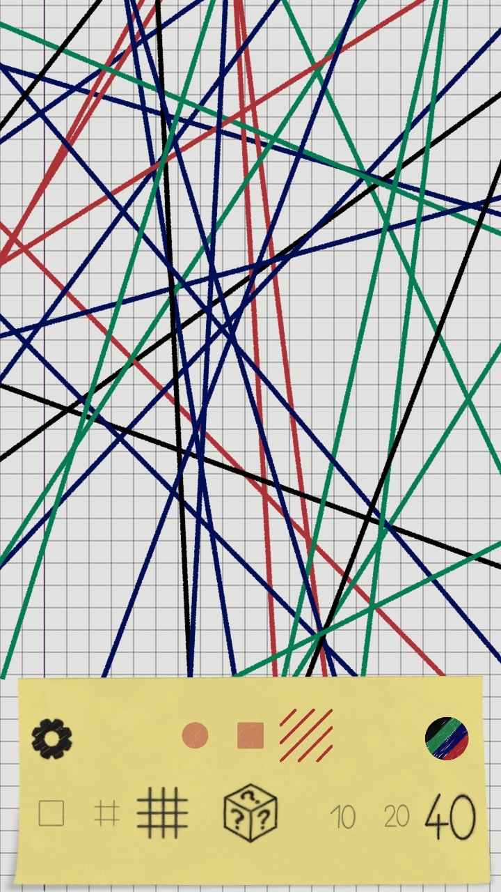
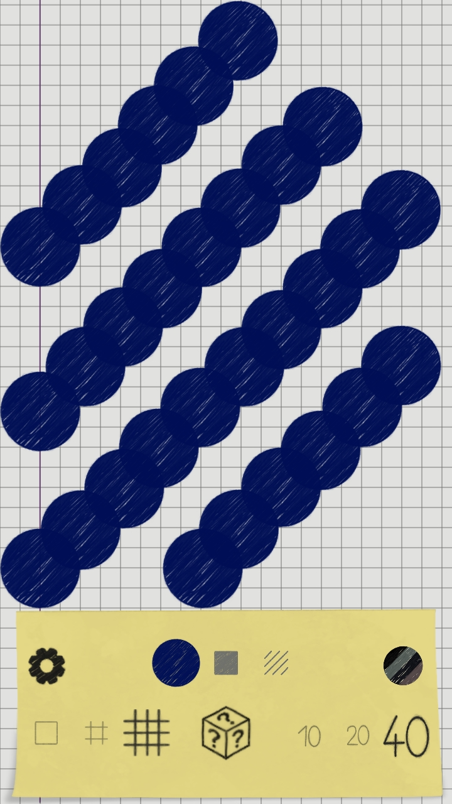
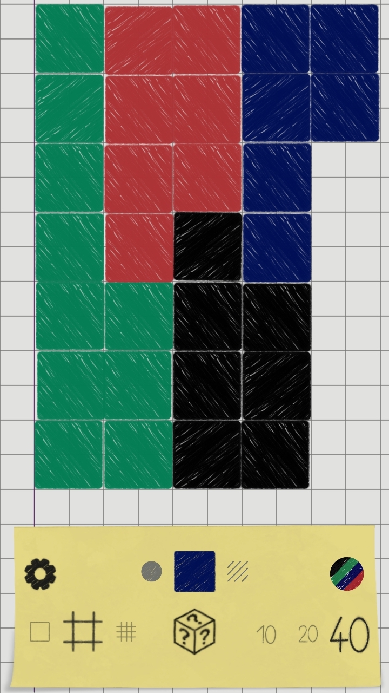
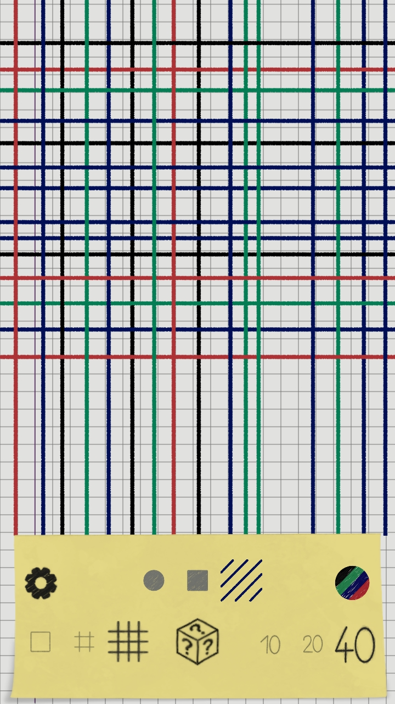
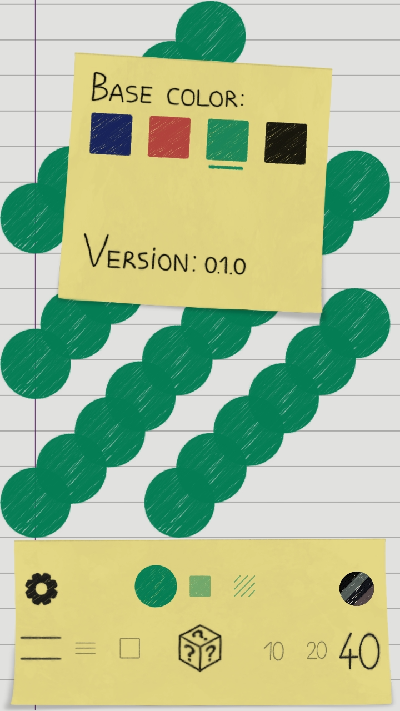

# NeedForOrder

The HTML5 version of NeedForOrder is now free to play on [itch.io](https://neurodivergentgames.itch.io/needfororder), or you can download the Android version on the [Google Play Store](https://play.google.com/store/apps/details?id=com.neurodivergentgames.needfororder). 

Second attempt at game development using the [Godot engine](https://godotengine.org/) with C#. Another abstract/clean/simple 2D-game without great expectations. 
Another much needed learnirng project, building on the (little) knowledge acquired in the making of [StickyBlocks](https://github.com/NeurodivergentGames/StickyBlocks) (give it a try: [StickyBlocks in itch.io](https://neurodivergentgames.itch.io/stickyblocks)).

## Game objective

Reorganize some chaotically placed geometric objects at will following your inner NeedForOrder. You can 
choose to reorganize randomally placed lines, squares, dots and disks. There is no specific goal: create your pattern/order, lower the entropy. You can also choose to use a background (faded) pattern to inspire and facilitate your need for order.

 &nbsp;&nbsp;&nbsp;
 &nbsp;&nbsp;
 
 

  

 &nbsp;&nbsp;&nbsp;
 &nbsp;&nbsp;&nbsp;
 

## My goals:

* Build and complete another little abstract game (completely on my own)
* Learning new Godot specific stuff, for example: better use of collision layer, multi-resolution support, touchscreen inputs support, Android export, place annoying ads in game...
* Learning new C# stuff, I will try to use more C# specific features even if not necessary or more complex: interfaces, delegates, events(when to use events instead of Godot's signals?), "when to use inheritance?", namespaces, setters...
* Try to write more SOLID code, more reusable, more generic (...not high hopes about these...)
* Try a different (from StickyBlocks) game structure planned in UML: using more state machine pattern, some globals (when makes sense), some specific managers classes (inputs manager, UI manager, main manager,...)     
* Put more faith in Godot and less in my maths skills (I studied theoretical physics): before going into the rabbit hole of mathematics, try to solve problems using Godot's features! 
* Create a base game mechanics (select/drag/drop/rotate/scale) to be reused in the future in different games (for example in a abstract or also not abstract puzzle game).
## Progress updates

### 23/02/2022
* Created and setup the Godot project: 2d/expand/portrait mode
* Created and connected the repository to VSCoce
* Planned the base structure of different classes/nodes in UML
* Created folders and files structure for the base objects
* Created the `Main` node structure it will contain: list of objects, UI stuff, some manager nodes  
* Created some base interfaces for different kind of geometrical object: `ISelectable`, `IMovable`, `IRotatable`, `IScalable`.
* Created `BaseObject` node: a `KinematicBody2D` with a to-be-defined `CollisionShape2D`
* Started to implemented `BaseObject` class
* Started to implemented `Main`: game machine logic and selection input handler
* Created a `Globals` namespace: `GAMESTATE` and `OBJECTSTATE` enums, `SCREENINFO` struct, `RandomManager` struct

### 26/02/2022
* Created `LevelBarriers` node and class: limits the game area, responsive to `Viewport.size_changed` signal 
* All inputs are handled in `Main` in a main `_UnhandleInput` function that first handles in a generic way the selection/unselection of object and then calls 
  `InputControlFlow` function of the selected object 
* Added a `Area2D` called `MouseArea`: a small `CollisionShape2D` under the mouse cursor, follows the mouse position 
* Create `RotatableObject` node: inherited scene of `BaseObject` with a second `KinematicBody2D` to be pressed to control the rotation → calls `GetOverlappingBodies()`
  in the selection/unselection input-handler function and returns the object on top
* Created `RotatableObject` as child of `BaseObject` and as `IRotatable`: implemented the `InputControlFlow` function to handle motion/rotation → basically 
  I recreated the selection/unselection/move/rotate functionalities of Godot's editor (or any 2d design software) but with the challenging interactions beetwen objects's 
  motion/rotation and `LevelBarriers` constraints
* Implemented a `_overlapple` variable for the objects (modifies with code the collision layer/mask)
* Created nodes and implemented classes of: `SquareObject`, `DotObject`, `DiskObject`  

### 02/03/2022
* Refactored scenes folders, files name...
* Created and implemented `GameUI`, `ScrollGameUI` scene as main UI elements, added `GameUI` as child node of `Main` scene in a `CavasLayer`
* Created and implemented `ScrollObjectType` (as child of `ScrollGameUI`) and `ScrollIconGameUI`: change type of object, press and drag left/right the icons of the scrollbar (I did not use `ScrollContainer` or similar), use tween to change Modulate and scale of selected/unselected icons, emit `ChangedObjectType` signal to `Main`
* `GameUI` input are handled by `_input_event` signal of the `Area2D` specific to a `ScrollGameUI`
* Added `PlayableSize` in `Globals.ScreenInfo` struct: `GameUI` limits the playable size (from `GetViewport().VisibleSize` to `PlayableSize`)
* Created `LineObject` scene: child of `RotatableObject` with a `Line2D`, `LineObject` is defined by the angular coefficient `_m` ($m$), x-axis intersection `_x0` ($x_0$) and y-axis intersection `_b` ($b$)
* Implemented `LineObject` random initialization and selection area collsion: choose random `_m`, `_x0` and `_b`, calculate the two intesection points of this line with `Globals.PlayableSize` and set this points as `Line2D.Points`, store the center point of the line and update the `SelectionAreaShape` shape
* `LineObject` has a specific `CollisionLayer` → it did NOT interact directly with `CollisionLayer` of `LevelBarriers`; the center point of the line is contrainted to be in the `PlayableSize`
* `LineObject` motion: mouse movement is related to movement in the $(x_0, b)$ parameter-space, the main `KinematicBody2D` does not move, movement is in the  $(x_0, b)$ parameter-space and update line points (intersection points with playable area) every frame (a mouse movement along the x-axis changes `_x0`, along the y-axis changes `_b`)

### 06/03/2022
* Implemented `LineObject` rotation: similar to motion, rotation takes place on the `_m` parameter; before the rotation setup the rotation center: it is the current line center (respect the intersection points) → so set $(x_0,b)$ equals to the center point (does not change the line and put the center rotation in the correct position)
* Implemented rotation snapping in `RotatableObject` (to default snaps every 45° with a delta-angle threshold 3°): smooth rotation unless $|TargetAngle - MultipleOfSnappingAngle| < DeltaAngleThreshold$
* Refactored some code/inheritance structure in/of `RotationObject`, `LineObject`, `BaseObject`: create some general function (like `InputRotationPressed`, `InputMovementMotion`...) to be called in the `HandleInputMotion` and `HandleInputRotation` function → reduced copy and paste code and makes motion/rotation more general
* Created `ScrollNumber` and `ScrollNumberIconGameUI` and connected to `Main`: scroll UI that can change number of objects spawned
* Adeed `ScrollNumber` to the main UI node `GameUI`

### 13/03/2022
* Added `RandomizeButton` to `GameUI` and connected to `Main`: re-randomize objects property, not number of objects spawned
* Implemented `RandomnizeObjects` in `Main` and `RandomizeObject` in `BaseObject`, calls overriden `InitRandomObject` and if necessary updates the others object members nedeed to redraw the object (like intersection points in `LineObject`) 
* Created `SaveHandler` namespace and `SaveObjectsHandler` as static class, contains: `SaveObjects` and `LoadObjects` → I followed Godot 3.4 docs, every time save function it's called it creates new dict (specific to current objects) for every objects and saves it in a JSON file; on load reads that specific file 
* On `ObjectTypeChanged` and `NumberChanged` signals emitted by `ScrollGameUI`, `Main` saves current objects-configuration and loads objects from a file if it exits else calls `SpawnRandomObjects`; calling the save function a file with name `${ObjectType}{NumberOfObjects}.save` is created
* `BaseObject`, `RotatableObject` and every specific object has `CreateDict` and `LoadData` functions
* Added a `Utilities` static class in `Globals` namespace, contains: `ObjectTypeToString` and `GetObjectScenePath` functions
* Created `ScrollBackgroundIconGameUI` and `ScrollBackground`: scroll icons to change background; contain a texture used as a tile (stretch mode Tile) to fill the background with a specific pattern

  
### 20/03/2022
* Created save system for background, saves in `${ObjectType}{NumberOfObjects}Background.save` the last background-pattern used and when number/type is changed the corrisponding icon in `ScrollBackground` it's seleceted; background saving separated to objects saving;
* Added some "wait-till-tween-completed" logic for `GameUI` scroll-icon input-events 
* Now  `LineObject` updates parameters on changes of the visibleRect area size   
* Now movable object updates to a valid position on changes of the visibleRect area size 
* Setup some Android export stuff: Android export template, Android build template, AndroidStudio for testing and USB testing/debugging
* Setup some stuff to try to intoduce some studid and annoying ads on Android: NativeLib addons, Applovin account/test_device/Ad_unit/banner
* Create `AdsHandler` (it's easier to use applovin_max autoloaded stuff in GDScript): `loadBanner` and signal `_on_shown_banner` and `_on_load_banner`
* Connected `AdsHandler` to main: show banner ads only when re-randomize objects (call GDscript from C# with Call function)
* Now selection/unselection/movement support touch input (not in a optimal/generic way but it works): emulate mouse from touch input it's on and add some `IsPressed` checking 
* Create new collisions detection for selection/unselection method  `ReturnTopObjectMobile` for touch input: desktop version uses the `MouseArea.GetOverlappingBodies` function and upload mouse position every physic frame → not possible for touch input (update `MouseArea` position only on touch); zero lenght raycast works strange with non-rectangular collision shape; Mobile version uses directly `Physics2DDirectSpaceState.IntersectPoint(GetGlobalMousePosition(),...)` → `MouseArea` not needed
* In `Main` added `ReturnTopObject` delegate and `_returnTopObject` private member of type `ReturnTopObject`: on ready sets  `_returnTopObject` to `ReturnTopObjectMobile` or `ReturnTopObjectDesktop` depending on `OS.HasTouchscreenUiHint()` value
* Change some scale factor/size of collsion shape of objects: they were too small for touch input (at least using my fingers...on my terrible phone...)
* Begun to think graphics/theme/colors stuff: blocknotes theme/doodle theme
* Add touch support for rotation input (NOT ELEGANT solution but it works, added a strange branch in `Main` input handler function only for rotatable object): mouse_entered and mouse_exited does not work with touch → only for `IRotatable` objects in `Main` first check with `Physics2DDirectSpaceState.IntersectPoint(GetGlobalMousePosition(),...)` if you are clicking on a `RotationArea`, if true then set `_rotatable` member of selected object to true
* Added some utility functions (`ObjectInterfaces` struct) and exported variable (for `ScrollGameUI` elements)

### 27/03/2022
* Add color on/off button: `ColorButton` object
* Connected color change to save system: save color option in background-save file
* `ScrollBackground` now automatically updates to correct icon when type or number of objects is changed
* Created basic tile for the background patterns and added a offset variable to center the different patterns relative to each others 
* Created `ColorObject` function in `BaseObject` and refactored in a more object-oriented way `InitRandomObject`/`RandomizeObject`; and a corrisponding `ColorObjects` in `Main`
* Added in `Globals` a static class for the main object colors: `Globals.Colors`
* Add some basic/terrible graphics (created using [Krita](https://krita.org/en/)): icon of tile for background patterns, background patterns tile, randomize button, color button, vertical line, setting icon, objects textures, settings panel and `GameUI` panel (post-it), `RotationArea` icon
* Copy and past [this shader](https://www.gdquest.com/tutorial/godot/shaders/gradient-map/) from a GDQuest's tutorial: color on/off of color button, if off set to a gray-scale-ish
* Some fixes and refactoring of: problem with line collision shape size and input event of `GameUI`; problem with tween completed/started of `GameUI` and gamestate flow (added `GAMESTATE.PAUSED`); save system creates "a lot" of godot's dictionaries "problem" with GC; `RotationArea` is always the top shape when object selected; `RotationArea` spawn position; ads frequency; double touch moving from `GameUI` to `PlayableSize` area; problem with `LineObject` rotation
* `SettingsPanel`: allow to change default/base color and display version number; post-it theme; connected with `Main`
* Small refactoring of `RotationArea` collision detection with `LevelBarriers`

### 03/04/2022
* Setup draft project [itch.io](https://neurodivergentgames.itch.io))
* Created app icon for mobile
* Created some gif/screenshots for itch.io page
* Fixed some inputs problems

### 11/04/2022
* Reduced android export size: compiled godot mono version, created custom android export with all modules disabled (expect webp module), use_lto on, no debug symbols, commented out some ClassDB in register source file, use basic/default R8/ProGuard stuff in build.gradle file -> arm64_v8a + armebi_v7a (release_debug and release) from ~38MB to ~26,1MB export size (mono is 6.1 MB) (still something is unclear to me)
* Created Google Play Console account
* Created and setup app in Google Play Console (internal testing phase)
* Created some gif/screenshots for itch.io page
* Fixed some inputs problems
* Fixed some bugs:  background save file, line movement, refactored out of bounds for itch.io HTML5-export problem -> `_Notification`

## 17/04/2022
* Created varius icon/cover image: itch.io cover image, google play cover image, google play main image, android app icon
* Fixed some small ads id unit problem
* Publish on itch.io (HTML5 version) and Google Play Store (Android version)
